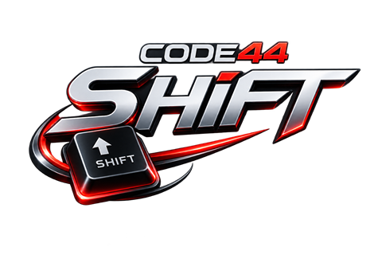

# CODE44 Shift

Умное переключение раскладки клавиатуры для Windows. Печатайте, не думая о
языке: программа исправляет слово, набранное не в той раскладке, автоматически
или по нажатию горячей клавиши.

## Скачать

**[Скачать установщик](https://github.com/Code44Team/Code44-Shift/releases/latest)**
— `CODE44_Shift_Setup_<версия>.exe`, подписан издателем CODE44.

Устанавливается для текущего пользователя, без прав администратора: ярлык в меню
Пуск (группа **CODE44**), автозапуск с Windows, обычное удаление через «Параметры
→ Приложения». Нужна Windows 10 или 11 (x64); ничего доустанавливать не нужно.

Что нового в каждой версии — в описании [релизов](https://github.com/Code44Team/Code44-Shift/releases).

## Возможности

- **Ручное переключение** последнего слова горячей клавишей — по умолчанию
  **Pause/Break**, можно назначить правый Ctrl, правый Shift или Scroll Lock.
- **Автоисправление раскладки**: `ghbdtn` → `привет`, `руддщ` → `hello` —
  распознаётся и исправляется на лету. Отключается одной галочкой.
- **Любая пара раскладок**: русская ↔ английская, русская ↔ казахская,
  английская ↔ казахская и другие. Таблицы клавиш берутся из самой Windows,
  недостающие языки подгружаются пакетами из общей базы.
- **Горячие клавиши** — отдельная страница настроек: сменить раскладку или
  регистр выделенного текста, транслитерировать, отменить конвертацию, включить
  или выключить автопереключение и звук, открыть настройки и дневник. Каждому
  действию назначается своя комбинация.
- **Правила автопереключения**: после того как слово переключено туда-обратно,
  программа предлагает запомнить правило — условие (содержать / начинаться /
  совпадать) и действие (переводить / не переводить). Плюс список исключений.
- **Дневник** — сохраняет набранный текст по приложениям. Пароли, номера карт и
  другие защищённые данные записываются как `********` и в открытом виде не
  сохраняются. Дневник хранится только на этом компьютере и не синхронизируется.
- **Синхронизация через Google Drive** — настройки, правила, исключения и история
  одинаковы на всех компьютерах с одним Google-аккаунтом. Вход в один клик,
  ничего настраивать не нужно.
- **Значок в трее** с быстрым меню: включить/выключить, автопереключение, звук,
  автозапуск, настройки, дневник.
- **Звук и уведомление** при исправлении — по желанию.

## Как пользоваться

1. Набрали слово не в той раскладке и заметили — нажмите **Pause/Break**. Слово
   перенабирается в другой раскладке, язык ввода переключается.
2. Если включено **автопереключение**, типичные ошибки исправляются сами,
   как только слово закончено.
3. Настройки и выход — правый клик по значку в трее (или двойной клик по нему).

Автоопределение намеренно осторожное: оно сочетает список частых русских и
английских слов с оценкой по гласным, буквосочетаниям и длине групп согласных,
чтобы не портить правильно набранный текст. Если оно промолчало — всегда
работает ручная горячая клавиша.

## Общая база переключений

В папке [`base/`](base) лежит общая база правил переключения: `index.json` со
списком пакетов и по файлу на пару языков. Программа читает её прямо отсюда —
кнопка **«Проверить раскладки»** в настройках смотрит, какие языки установлены в
системе, и предлагает подгрузить нужные пакеты, а **«Обновить базу
переключений»** подтягивает свежую версию.

Своё правило можно отправить в общую базу галочкой «Отправить разработчикам» в
окне нового правила — оно приедет к нам заявкой и попадёт в следующий пакет.

## Поддержка

Ошибки и пожелания — во [вкладку Issues](https://github.com/Code44Team/Code44-Shift/issues).
Сайт издателя — [code-44.com](https://code-44.com).

Разработка: **Anato Fabian** (Anatoliy Shipilov), **Mstr. DOC** (Nikolay Burlachenko).
Тестирование: **WMGO** (Roman Mamrashev), **Mako** (Vazgen Sarkisian).

© 2026 CODE44
